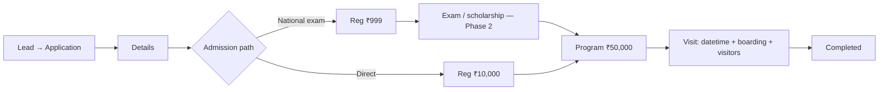

# Student admission flow (Phase 1)

## High-level path

## Fees

- **Registration:** Path-based — national exam ₹999, direct ₹10,000. Amounts are defined in `src/lib/student-application-fees.ts` (paise for Razorpay).
- **Standard checkout:** Creating a Razorpay order for the fixed registration fee requires an admission path. **Custom** Razorpay amounts can still complete the registration step without a path (exceptions / migration).
- **Programme fee:** ₹50,000 (unchanged).

## Visit capture

- **Single combined visit:** one `datetime-local` for admission counselling + campus tour (`admissionVisitAt`); `campusTourAt` is cleared for new saves.
- **Boarding address:** current address text (`boardingAddress`).
- **Visitors:** integer count 1–500 (`visitVisitorCount`).
- **Legacy:** older rows may still have structured DD/MM/YYYY + slot + `admissionVisitAddress` and/or a separate `campusTourAt`; the API still accepts those fields for backward compatibility.

## University vs partner leads

- Partner API lists leads with `createdByUserId = current user` and `universityId = active gate university`.
- University **Admissions** lists all leads for `universityId` from the URL. If a partner lead is missing there, check the lead’s `universityId` matches that hub and that year/stream filters aren’t hiding the row.

## Phase 2 (stubbed in UI)

National-exam route shows a placeholder after registration is paid; real MCQ, prep entitlements, and scholarship rules are not implemented yet.
